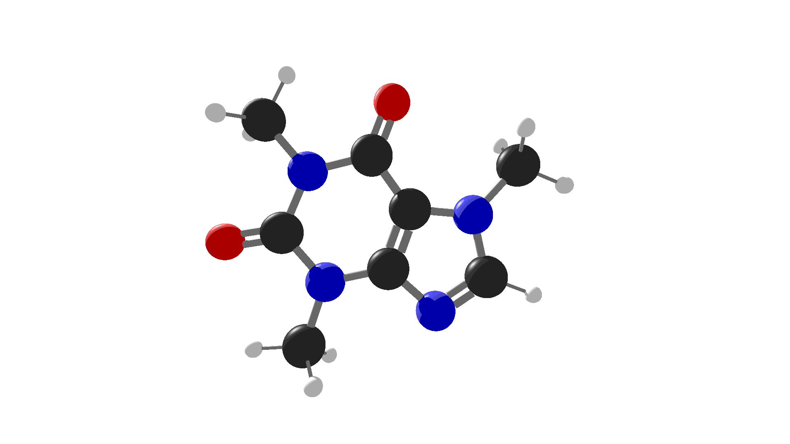

# molgif

`molgif` generates beautiful GIFs of rotating molecules using SDF as input.



short intro:

```bash
go run main.go caffeine.sdf
```

or use as binary

```bash
go build -o molgif main.go
```

have fun
